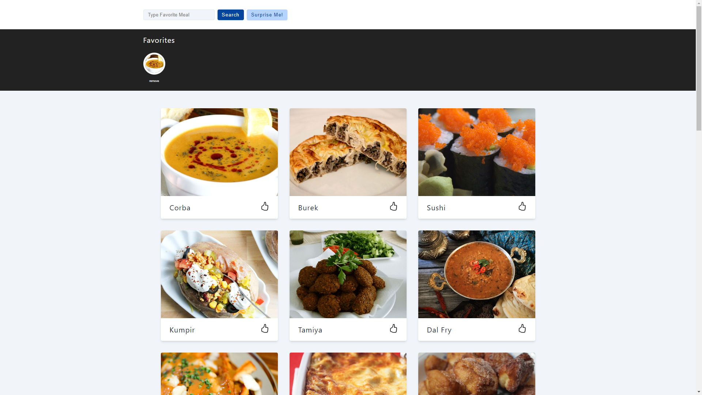

# Meals App

## Created With:
- React
- Styled Components
- Context API
- Axios

## Links
- Live Site URL: [Meals App](https://mikowesome-meals-app.netlify.app/)

## Project Screenshot

## Project Description

- Meals App is a react application that fetches different meal data from a public API called Meals DB. This application lets you search for a meal, view a meal and add a meal to your favorites.
